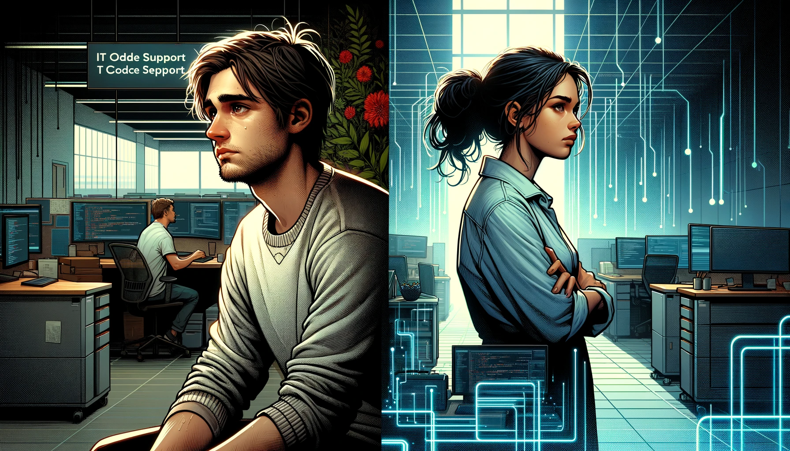

# The Ambitious Developer

In the heart of Digital Haven, a hub of technological innovation, stood the illustrious company CodeCrafters, co-founded by the strategic Morgan and two adept developers, Jordan and Casey. Known for groundbreaking software solutions, CodeCrafters was a beacon in the tech world.

Jordan, with her meticulous and committed approach, was integral to the company's operations and long-term planning. In contrast, Casey was celebrated for his creative and adventurous spirit in technology.

One day, Casey approached Morgan, fueled by ambition. "I wish to chart my own course in the tech world," he said. "Could I leave CodeCrafters to pursue my own venture?" Understanding his desire to explore, Morgan consented, and Casey departed with a portion of his early shares.

Casey ventured into Silicon Heights, a city synonymous with innovative startups. He launched his own company, pouring his shares and energy into what he envisioned as a tech revolution. His company, 'NextGen Innovations', started with a flourish, attracting young talent and media attention with its bold visions and luxurious office culture.

But the glimmer of Silicon Heights masked the underlying challenges of the tech startup world. Casey, driven by passion more than practicality, invested heavily in high-risk projects. He believed in transforming the tech landscape overnight, pouring resources into cutting-edge but untested technologies.

As months turned into a year, the reality of managing a tech startup began to weigh heavily on Casey. The initial investments, instead of yielding the revolutionary products he had envisioned, led to prototypes that were far from market-ready. His lack of experience in sustainable business practices became evident as his company struggled to secure additional funding.

Meanwhile, back in Digital Haven, Jordan continued to work closely with Morgan, further solidifying CodeCrafters' reputation for reliable and innovative tech solutions.

In Silicon Heights, Casey's situation worsened. The high costs of running a lavish startup with no substantial revenue streams began to take its toll. Investors became restless, and talented staff started to leave, lured away by more stable opportunities. Casey found himself facing mounting debts and dwindling resources.

Eventually, the inevitable happened. NextGen Innovations, unable to sustain itself, collapsed. The dream that Casey had pursued so fervently disintegrated, leaving him financially and emotionally drained. He was forced to sell his remaining assets to pay off debts.

With limited options, Casey took a job at a small IT support company in Silicon Heights. The work was mundane and unchallenging, a stark contrast to his ambitious plans at NextGen. He spent his days troubleshooting basic software issues, a far cry from his aspirations of being a tech pioneer.

During this period of struggle, Casey underwent a profound transformation. The fall from a celebrated CEO to a low-level tech support worker humbled him. He reflected on his decisions, recognizing his naivety and recklessness. The hard lessons of failure taught him the value of sustainable growth, thorough planning, and the importance of balancing innovation with feasibility.

Realizing the depth of his learning, Casey decided to return to Digital Haven, seeking a fresh start at CodeCrafters. He hoped to rejoin the company, acknowledging that he would have to start from a lower position, leveraging the hard lessons he had learned.

Upon his return, Morgan welcomed Casey with understanding and kindness. "You've come back with experiences that are invaluable," Morgan said. Though Casey was rehired, it was clear that his role would be more modest, aligned with his recent experiences.

Jordan, who had been pivotal in CodeCrafters' success during Casey's absence, initially struggled with his return. She expressed her concerns to Morgan, who reassured her, "Your dedication has been the backbone of CodeCrafters. Casey's return does not overshadow your achievements. He rejoins us not to his old status but as someone who has matured through his journey."

Casey, now back at CodeCrafters in a less prominent role, was grateful for the opportunity to contribute anew. Jordan, recognized for her steadfast dedication, maintained her significant position. Together, they helped propel CodeCrafters forward, benefiting from Jordan's consistent expertise and Casey's newfound perspective born from his ambitious yet humbling journey.
